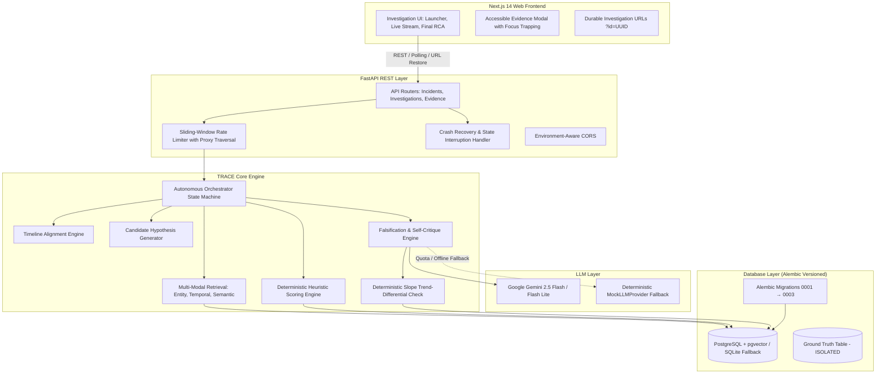

# TRACE — Telemetry Root-cause Autonomous Critique Engine

[]()
[-blue.svg)]()
[]()
[-black.svg)]()
[-blueviolet.svg)]()
[]()

TRACE is an autonomous incident investigation engine that ingests multi-modal observability telemetry (metrics, logs, traces, database locks, alerts, and CI/CD deployment events) and determines the true root cause of complex distributed system outages.

Unlike naive single-shot LLM prompts that fall prey to hallucination, recency bias, and distractor deployments, TRACE implements a **deterministic state machine, multi-factor hypothesis ranking, and a self-critique/falsification engine** with code-driven trend-differential verification and end-to-end evidence grounding.

---

## 1. Problem

During major microservice outages, site reliability engineers (SREs) face alert storms spanning hundreds of noisy logs, cascading error spikes, and simultaneous deployment events. 

Single-shot LLM prompts consistently fail in realistic environments because:
1. **Recency Bias**: LLMs disproportionately blame the most recent deployment commit, even when telemetry shows an underlying continuous memory leak or datastore lock contention preceded the release.
2. **Ungrounded Hallucinations**: LLMs cite plausible-sounding causes without linking claims back to verified database telemetry records.
3. **No Self-Critique**: Naive LLMs generate a single explanation without actively attempting to formulate testable hypotheses or search for contradicting telemetry.
4. **Opaque Confidence**: LLMs frequently claim 100% confidence on completely incorrect attributions without any inspectable scoring methodology.

TRACE solves this by separating **hypothesis generation and interpretation** (powered by Gemini) from **deterministic scoring, timeline alignment, and slope trend-differential verification** (implemented in pure Python).

---

## 2. Live Demo & Execution Modes

- **Live Frontend**: [https://trace-rca-engine.vercel.app](https://trace-rca-engine.vercel.app)
- **Live Backend API**: [https://trace-rca-engine.onrender.com/docs](https://trace-rca-engine.onrender.com/docs) *(Swagger UI)*

TRACE provides two distinct execution paths with full provider transparency:

1. **Demo Replay (Verified Reference Incident)**:
   - Replays a pre-computed reference investigation (`bad_deployment_db_exhaustion`, seed=1) generated with `MockLLMProvider`.
   - Streams the 8 state transitions progressively with **synthetic telemetry stored in the database and available for inspection**.
   - Zero LLM API quota consumption; guaranteed 100% reliable evaluation for demonstration purposes.
2. **Custom Incident Live Run**:
   - Generates a new synthetic incident into the telemetry store (e.g., Memory Leak with Masked Deployment, Dependency Failure Cascade, or Database Connection Pool Saturation) and runs the live orchestrator pipeline end-to-end.
   - Automatically labels execution with provider metadata (`Live Gemini` with exact model, `Mock Provider` fallback, or `Unknown (historical run)`).

---

## 3. Architecture



---

## 4. Key Reliability & Engineering Highlights

### 🛡️ Durable State Machine & Crash Recovery
- **8-State Deterministic Lifecycle**: `INIT` $\rightarrow$ `INGESTING` $\rightarrow$ `HYPOTHESES_GENERATED` $\rightarrow$ `HYPOTHESES_RANKED` $\rightarrow$ `INVESTIGATING_HYPOTHESIS` $\rightarrow$ `CRITIQUING_HYPOTHESIS` $\rightarrow$ `RCA_GENERATED` / `INCONCLUSIVE`.
- **Interruption Recovery**: In the event of backend worker restarts or infrastructure drops, stale in-flight investigations are detected and safely marked `interrupted` with actionable error diagnostics, preventing indefinite frontend polling hangs.
- **Durable Investigation URLs**: Completed or active investigations can be restored or shared at any time via `?id=<uuid>`, correctly reconstructing Demo Replay vs. Live Run modes from persisted database state.

### 🔍 Transparent Provider Attribution
- **Explicit Badging**: Process views and final RCA reports explicitly declare the active LLM engine (`Gemini 2.5 Flash`, `MockLLMProvider`, or `Unknown (historical run)`).
- **Graceful Quota Fallback**: If Gemini rate limits or quotas are reached, TRACE seamlessly falls back to the deterministic mock provider and explicitly marks the run metadata as fallback-backed.

### ⚖️ Rigorous Candidate Verdicts & Heuristic Confidence
- **Strict Refutation Semantics**: Candidates are only labeled **REFUTED** when explicit contradictory telemetry is found. Lower-ranked candidates or those lacking confirmation are labeled **WEAKENED** or **UNCONFIRMED**, preventing false refutation claims.
- **Deterministic Heuristic Confidence**: Confidence percentages are computed purely algebraically in code based on verified evidence count, citation density, and contradiction penalties.

### ♿ Accessible Evidence Inspector (WCAG Compliant)
- Interactive evidence citations open a fully accessible modal dialog equipped with focus trapping (`Tab` / `Shift+Tab`), `Escape` key dismissal, backdrop click closing, `prefers-reduced-motion` animation compliance, and automatic focus restoration to the triggering citation pill.

### 🔒 Reverse Proxy Aware Rate Limiting
- Sliding-window token bucket rate limiter traverses forwarded client IPs right-to-left across trusted reverse proxies (Render, Cloudflare, AWS ALB), preventing spoofed `X-Forwarded-For` denial-of-service vectors.

### 🗄️ Versioned Alembic Migrations
- Managed schema migrations (`0001_initial_schema`, `0002_add_investigation_state_records`, `0003_inv_provider_fields`) ensuring zero data loss across upgrades on both SQLite and PostgreSQL.

---

## 5. AI Architecture — Explicit Boundaries

A core design principle of TRACE is strictly defining where LLMs are used versus where deterministic code is enforced:

### Where the LLM IS Used:
* **Candidate Proposal**: Synthesizing descriptive candidate titles from raw error patterns.
* **Evidence Interpretation**: Evaluating whether a specific retrieved log snippet contradicts or supports an inquiry.
* **Falsification Inquiries**: Generating testable questions (*"Did upstream API gateways experience timeouts before the deployment finished?"*).
* **Executive RCA Synthesis**: Writing human-readable markdown summaries grounded strictly in cited UUIDs.

### Where the LLM IS NOT Used (Deterministic Code):
* **Hypothesis Scoring**: Composite scoring formula combining recency, metric anomaly z-score, database lock duration, and service topology distance.
* **Falsification Verdict Logic**: Contradiction score penalties and status transitions are calculated strictly in code.
* **Trend-Differential Verification**: Linear regression slope computation of metric time series (`memory_mb`, `cpu_pct`) before vs. after deployments.
* **Confidence Scoring**: Direct algebraic calculation based on verified evidence count, citation density, and contradiction penalties.

---

## 6. Evidence Model & Ground Truth Isolation

### UUID-Grounded Citations
Every citation pill displayed across the investigation process and final report links directly to a stored telemetry record in the database (timestamp, service, severity, message, metric values, database locks). Clicking any citation opens the raw telemetry record in the Evidence Modal for independent verification.

### Strict Ground Truth Isolation
* **Zero Runtime Leakage**: Runtime orchestrator and retrieval queries are prohibited from joining or querying the `ground_truths` table.
* **Hermetic Evaluation**: Ground truth is evaluated solely within the offline evaluation harness (`services/api/app/eval/`) after the investigation state machine has persisted its final terminal state.

---

## 7. Synthetic Incident Generator

TRACE features a deterministic, seeded synthetic incident generator covering 3 complex failure archetypes:

1. **`bad_deployment_db_exhaustion`**: A service deployment introduces an unindexed query regression that saturates connection pools and causes HTTP 504 cascades.
2. **`dependency_failure_cascade`**: A downstream microservice suffers internal thread pool exhaustion, cascading timeouts upstream through the service topology.
3. **`memory_leak_masked_deployment`**: A service suffers a steady memory leak and GC pause lockups over hours. An innocent routine configuration deployment occurs minutes before the crash, acting as an intentional red herring.

---

## 8. Verified Benchmark & Evaluation

Every statistic below comes directly from recorded benchmark evaluation runs across **19 seeded synthetic incidents across three archetypes** (`data/benchmark/results.json`, `data/benchmark/report.md`):

> **Scope Note**: This benchmark evaluates causal reasoning, distractor handling, and trend verification on seeded synthetic incident topologies with hidden ground truth. It isolates specific failure modes under controlled conditions and does not establish measured accuracy across arbitrary real-world production environments.

### Overall Benchmark Results (19 Incidents)

| System | Incidents Evaluated | Root Cause Accuracy | Correct / Total |
| :--- | :---: | :---: | :---: |
| **TRACE (Full Engine)** | **19** | **89.5%** | **17 / 19** |
| **Naive LLM Baseline** | 19 | 73.7% | 14 / 19 |
| **Performance Delta** | — | **+15.8%** | **+3 Incidents** |

### Breakdown by Incident Archetype

| Incident Type | Scenarios | TRACE Accuracy | Naive Baseline | Delta |
| :--- | :---: | :---: | :---: | :---: |
| `bad_deployment_db_exhaustion` | 7 | **100.0%** (7/7) | 100.0% (7/7) | +0.0% |
| `dependency_failure_cascade` | 7 | **100.0%** (7/7) | 100.0% (7/7) | +0.0% |
| `memory_leak_masked_deployment` | 5 | **60.0%** (3/5) | 0.0% (0/5) | **+60.0%** |

### Benchmark Analysis & Findings
1. On standard deployment saturation and dependency cascades, both TRACE and the naive single-shot baseline achieved 100% (7/7 each) due to clear causal log/metric signatures.
2. On the **Memory Leak with Masked Deployment** scenario (`memory_leak_masked_deployment`):
   - The naive single-shot LLM baseline scored **0.0% (0/5)**: due to window truncation and prompt recency bias, the baseline reported "system operating normally" (4/5) or cited an unrelated low-inventory warning (1/5).
   - TRACE achieved **60.0% (3/5)** by utilizing multi-modal retrieval and deterministic trend-differential verification (`trend_differential_check.py`) to verify that the memory growth slope preceded the deployment release.
   - TRACE misattributed the root cause in 2 edge cases (`bench-mem-02` and `bench-mem-04`), detailed in the failure analysis below.

---

## 9. Failure Analysis — Unsolved Edge Cases

Honest analysis of the two memory-leak benchmark runs where TRACE did not confirm the true ground-truth root cause:

### 1. `bench-mem-02` (Misattributed to Deployment Distractor)
* **Outcome**: TRACE failed, predicting `"Bad deployment to checkout-service (v2.16.0)"` with **76.0% confidence** (Baseline failed, predicting `"System operating normally"` with 100.0% confidence).
* **Analysis**: In this seed's specific metric noise and timing, the coincidental deployment candidate accumulated sufficient baseline score and survived the critique threshold, resulting in misattribution to the deployment distractor rather than the underlying memory leak.

### 2. `bench-mem-04` (Misattributed to Downstream Dependency)
* **Outcome**: TRACE failed, predicting `"Downstream dependency failure in payment-service"` with **86.0% confidence** (Baseline failed, predicting `"No critical root cause or failure detected"` with 95.0% confidence).
* **Analysis**: Long stop-the-world GC pauses from the heap exhaustion triggered connection timeouts to `payment-service`. TRACE's candidate scoring ranked the payment cascade hypothesis highest, and self-critique failed to refute it, misdiagnosing the downstream symptom as the root cause.

---

## 10. Engineering Trade-offs & Scope Decisions

* **Synthetic Generator vs. Real Docker Microservices**: Synthetic telemetry generation allows deterministic seeding, rapid test suite execution (179 tests in seconds), and 100% reproducible benchmark evaluation.
* **Dual-Engine DB Support (PostgreSQL / SQLite)**: Native PostgreSQL with pgvector for production environments paired with SQLite fallback for zero-dependency local development and CI testing.
* **FastEmbed In-Process Embeddings**: FastEmbed runs ONNX models locally in-process with Python cosine similarity, eliminating external vector database maintenance.

---

## 11. Local Setup

### Prerequisites
* Python 3.11+
* Node.js 18+
* Google Gemini API Key (optional for Mock mode, required for live LLM mode)

### 1. Backend Setup
```bash
cd services/api
python -m venv .venv
# On Windows: .venv\Scripts\activate | On Linux/macOS: source .venv/bin/activate
pip install -r requirements.txt

# Configure environment
cp .env.example .env
# Set GEMINI_API_KEY in .env (if testing with live Gemini)

# Run database migrations
alembic upgrade head

# Start FastAPI backend
python -m uvicorn app.main:app --host 127.0.0.1 --port 8000 --reload
```

### 2. Frontend Setup
```bash
cd services/web
npm install
npm run dev
```

Open [http://localhost:3000](http://localhost:3000) in your browser.

### 3. Run Full Test Suite
```bash
cd services/api
python -m pytest tests/ -v
# 179 / 179 tests passing
```

---

## 12. Production Deployment

### Backend (Render / Railway)
1. Create a new Web Service pointing to `services/api`.
2. Configure Environment Variables:
   * `GEMINI_API_KEY`: Your Gemini API Key
   * `GEMINI_MODEL`: `gemini-2.5-flash`
   * `CORS_ORIGINS`: `https://your-frontend.vercel.app`
   * `DATABASE_URL`: Managed PostgreSQL connection string (or omit for local SQLite volume)
3. **Build Command**: `pip install -r requirements.txt`
4. **Start Command**:
   ```bash
   alembic upgrade head && python -m uvicorn app.main:app --host 0.0.0.0 --port $PORT --workers 1 --limit-concurrency 50
   ```

### Frontend (Vercel)
1. Import repository on Vercel with Root Directory set to `services/web`.
2. Configure Environment Variable:
   * `NEXT_PUBLIC_API_URL`: `https://your-backend.onrender.com`
3. Deploy.
